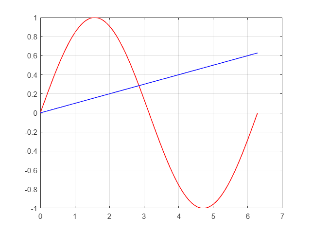

```matlab:Code
f=@(x) sin(x)-x/10;
fsolve(@(x) sin(x)-x/10,1.57);
```

```text:Output
Equation solved.

fsolve completed because the vector of function values is near zero
as measured by the value of the function tolerance, and
the problem appears regular as measured by the gradient.

<stopping criteria details>
```

```matlab:Code
x=0:0.01:2*pi;
figure(1)
t=1;
plot(x,sin(x),"Red",LineWidth=t)
hold on
plot(x,x/10,"blue",LineWidth=t)
hold off
grid on
```



                                                   
$$
\sin \left(x\right)\;\textrm{and}\;x\;\textrm{point}\;\textrm{of}\;\textrm{intersection}
$$

```matlab:Code

```
